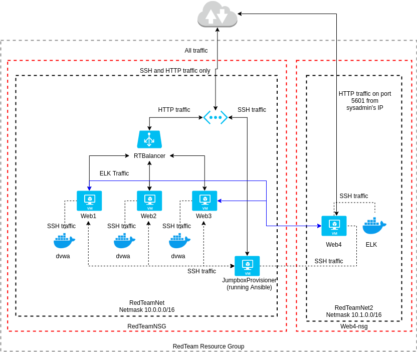
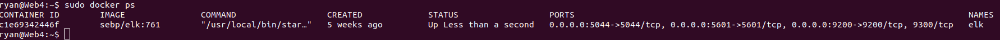

## Automated ELK Stack Deployment

The files in this repository were used to configure the network depicted below.

These files have been tested and used to generate a live ELK deployment on Azure. They can be used to either recreate the entire deployment pictured above. Alternatively, select files in the `Ansible/roles` directory may be used to install only certain pieces of it, such as Filebeat.

This document contains the following details:
- Description of the Topology
- Access Policies
- ELK Configuration
  - Beats in Use
  - Machines Being Monitored
- How to Use the Ansible Build

### Description of the Topology

The main purpose of this network is to expose a load-balanced and monitored instance of DVWA, the D*mn Vulnerable Web Application.

Load balancing ensures that the application will be highly available, in addition to restricting access to the network.

Integrating an ELK server allows users to easily monitor the vulnerable VMs for changes to the filesystem and system resource usage.

The configuration details of each machine may be found below.
_Note: Use the [Markdown Table Generator](http://www.tablesgenerator.com/markdown_tables) to add/remove values from the table_.

| Name                 | Function     | IP Address | Operating System |
|----------------------|--------------|------------|------------------|
| Jump Box Provisioner | Gateway      | 10.0.0.4   | Linux            |
| Web1                 | DVWA server  | 10.0.0.5   | Linux            |
| Web2                 | DVWA server  | 10.0.0.6   | Linux            |
| Web3                 | DVWA server  | 10.0.0.7   | Linux            |
| Web4                 | ELK  server  | 10.1.0.4   | Linux            |

### Access Policies

The machines on the internal network are not exposed to the public Internet. 

Only the "Jump Box Provisioner" and "Web4" machines can accept connections from the Internet. Access to these machines is restricted to the following ports and IP addresses:
- Jump Box: port 22 from 24.21.165.141
- Web4: port 5601 from 24.21.165.141

"Web4" also receives traffic from the DVWA servers on ports 5601, 9200, and 5044.

Otherwise, machines within the network can only be accessed by "Jump Box Provisioner."

A summary of the access policies in place can be found in the table below.

| Name                 | Publicly Accessible | Allowed IP Addresses      |
|----------------------|---------------------|---------------------------|
| Jump Box Provisioner | Yes                 | 24.21.165.141             |
| Web4                 | Yes                 | 24.21.165.141, 10.0.0.4-7 |
| Web1                 | No                  | 10.0.0.4                  |
| Web2                 | No                  | 10.0.0.4                  |
| Web3                 | No                  | 10.0.0.4                  |

### Elk Configuration

Ansible was used to automate configuration of the ELK machine. No configuration was performed manually, which is advantageous because
it saves time and effort, reduces the likelihood of a mistake, facilitates repeatability, and provides accurate and trustworthy
documentation regarding how those machines were provisioned.

The playbook implements the following tasks:
- Installs Docker, the python3-pip package, and the Docker Python module.
- Bumps up the system's virtual memory.
- Downloads and launches an ELK Docker container.

The following screenshot displays the result of running `docker ps` after successfully configuring the ELK instance.

### Target Machines & Beats
This ELK server is configured to monitor the following machines:
- 10.0.0.5
- 10.0.0.6
- 10.0.0.7

We have installed the following Beats on these machines:
- Filebeat
- Metricbeat

These Beats allow us to collect the following information from each machine:
- Filebeat tracks changes to files. E.g., it can stream new entries to log files in real time.
- Metricbeat tracks resource usage. E.g., it can report on things like CPU and memory usage.

### Using the Playbook
In order to use the playbook, you will need to have an Ansible control node already configured. Assuming you have such a control node provisioned: 

SSH into the control node and follow the steps below:
- Copy the contents of the Ansible directory to /etc/ansible.
- Update the hosts file to include the IP addresses of the target machines, and update ansible.cfg to use the right "remote_user" value.
- Run the playbooks, and navigate to the ELK IP address, port 5601, to check that the installation worked as expected.
